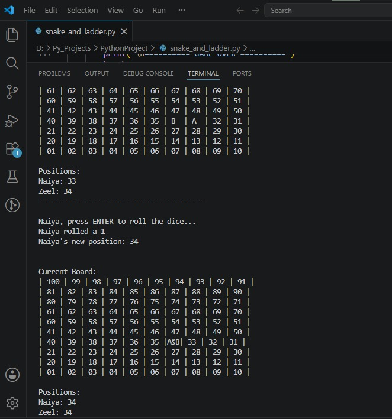
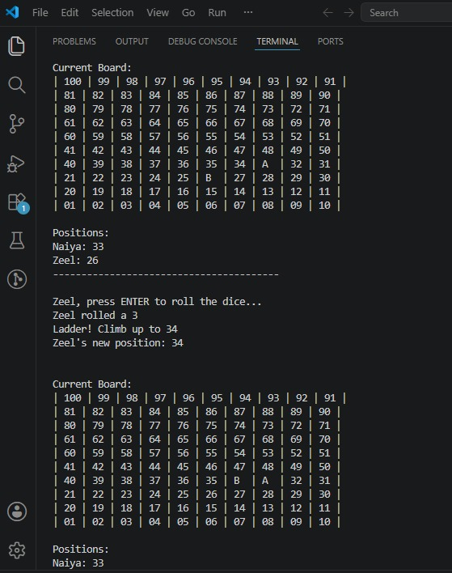
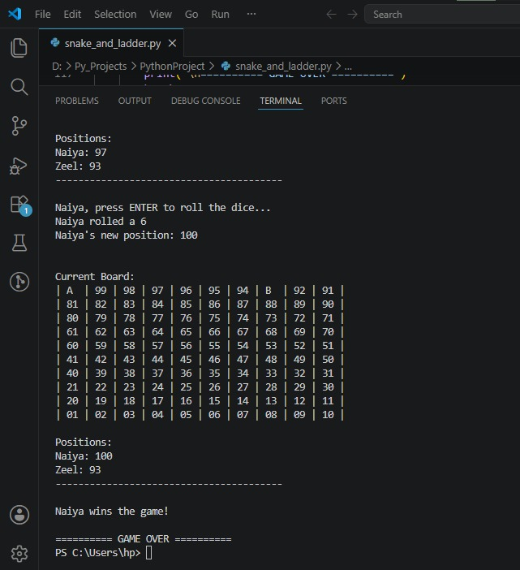

# 🐍 Snake and Ladder Game (Python)


A console-based Snake and Ladder game developed in Python. This project recreates the classic board game with two-player gameplay, random dice rolling, snakes, ladders, and a dynamic game board.

---

## 📌 Features

- Two-player gameplay
- Random dice rolling (1–6)
- Players must roll **1** or **6** to enter the game
- Snakes decrease the player's position
- Ladders increase the player's position
- Dynamic board display after every turn
- Winner announcement when a player reaches **100**

---

## 🛠️ Technologies Used

- Python 3
- Random Module

---

## 📂 Project Structure

```text
Snake_and_Ladder/
│── snake_and_ladder.py
│── README.md
│
└── assets/
    ├── board.jpg
    ├── ladder.jpg
    ├── winner.jpg
    └── gameplay.mp4
```

---

## ▶️ How to Run

### Clone the repository

```bash
git clone https://github.com/naiya555/Snake-and-Ladder-Game.git
```

### Open the project folder

```bash
cd Snake-and-Ladder-Game
```

### Run the game

```bash
python snake_and_ladder.py
```

---

## 📸 Screenshots

### 🖥️ Game Board



---

### 🪜 Ladder Event



---

### 🏆 Winner



---

## 🎥 Gameplay Video

The gameplay recording is available in the project folder.

**Location:**

```text
assets/gameplay.mp4
```

---

## 🎮 Game Rules

- The game supports two players.
- Roll **1** or **6** to start the game.
- Landing on a ladder moves the player upward.
- Landing on a snake moves the player downward.
- The first player to reach **100** wins the game.

---

## 🚀 Future Improvements

- GUI version using Tkinter or Pygame
- Single-player mode against the computer
- Difficulty levels
- Save and load game progress
- Sound effects and animations

---

## 👩‍💻 Author

**Naiya Sharma**

GitHub: **https://github.com/naiya555**

---

## 📜 License

This project is developed for learning and educational purposes.

---

⭐ If you like this project, consider giving it a **Star** on GitHub.
GitHub: **[naiya555](https://github.com/naiya555)**
